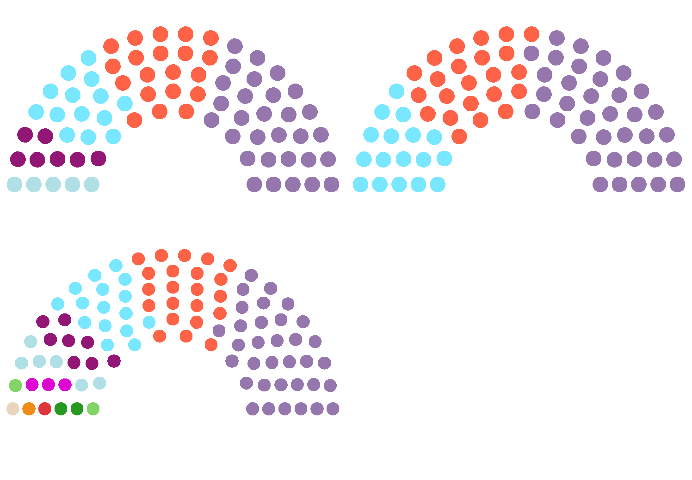

Progetto di Ingegneria Informatica: **Simulatore di sistemi elettorali**

# Obiettivi

Questo progetto si prefigge di sviluppare un framework che faciliti il processo di modellazione 
di un sistema elettorale e la simulazione dei risultati elettorali ottenuti applicando il sistema
a dati scrutinati, siano essi dati generati manualmente o risultati di una vera elezione

Tali simulazioni potrebbero essere effettuate per valutare l'impatto di una variazione di sistema 
elettorale sulla rappresentanza politica in un territorio, tali variazioni potrebbero per esempio
essere il passaggio da una legge di natura proporzionale ad una di natura maggioritaria, ovvero
la rimozione o variazione di una soglia di sbarramento in una legge di natura proporzionale.

Alternativamente si potrebbe voler studiare, a parità di sistema elettorale, gli effetti di una
diminuzione di seggi o di una variazione dei collegi elettorali.

Infine si potrebbero voler simulare i risultati di un'elezione dato un sondaggio

Con il sistema qui sviluppato la definizione del funzionamento di un sistema elettorale è 
semplificata attraverso l'adozione di una sintassi semplificata che richiede la minor quantità di
codice possibile, rimanendo tuttavia estendibile tramite python puro dove tale flessibilità sia
necessaria

## Limitazioni e ipotesi adottate

Volendo mantenere la sintassi definita il più semplice possibile le funzionalità definite in
questo progetto sono concentrate su sistemi a singolo turno, escludendo quindi i sistemi
che prevedono ballottaggi (per esempio il modello francese) o quei sistemi a turni multipli 
virtuali quali il modello irlandese.

Tuttavia questi modelli possono essere studiati integrando con del codice python ad-hoc che simuli
il doppio turno chiamando ripetutamente questo modulo, o scrivendo manualmente delle funzioni che
simulino il processo di trasferimento delle preferenze del sistema irlandese

Infine questo sistema permette di avere due sistemi elettorali operanti in parallelo, quali il
sistema plurinominale e quello uninominale della legge Rosato o del sistema tedesco; tuttavia si
presuppone che la struttura sia omogenea, pertanto non è possibile simulare direttamente leggi 
elettorali diverse operanti su aree geografiche diverse.

Il sistema non è pertanto orientato a supportare elezioni quali le elezioni per il parlamento
europeo (avendo 27 leggi elettorali diverse) o le presidenziali americane (permette tuttavia
di simulare il processo di elezioni presidenziali nei 48 stati che assegnano i loro voti nella
medesima maniera)

# Funzionalità 

Il programma prevede 4 livelli di configurazione

1. Codice sorgente, modificando il contenuto delle cartelle src/Metaclasses e src/Commons si può 
modificare il comportamento di base del programma, tuttavia questo tipo di modifica, sebbene 
possibile è superfluo per quanto riguarda src/Metaclasses nei casi considerati e limitato a
inserire in src/Commons file contenenti funzioni cui ci si riferisce nelle configurazini di classe
2. Definizione di classi, tramite file yaml (o file python per classi più complesse).
Tramite questi file si definisce il comportamento di ogni componente, questi corrispondono alla
legge elettorale che si intende modellare
3. Definizione di istanze, tramite file yaml. Questi file definiscono con che parametri creare le
istanze delle classi definite al punto precedente e corrispondono (nel mondo reale) alla 
definizione delle circoscrizioni elettorali, del numero di seggi da distribuire e alle
dichiarazioni delle varie liste e dei candidati che parteciperanno alle elezioni
4. Definizione dei risultati delle votazioni tramite file csv, questi forniscono alle classi di
competenza il risultato delle votazioni, siano essi risultati veri o simulati

Una volta elaborate queste informazioni il programma simula il risultato delle elezioni
restituendo una lista di candidati eletti.

Questa lista conterrà per ogni candidato eletto il nome e il partito di appartenenza

## Input del programma:
+ path della configurazione, una cartella contenente le cartelle:
    + class
    + instance
    + data 

### Configurazione classi:
Nella cartella ci possono essere file del tipo:
+ Nome_classe.yaml o
+ Nome_classe.py

I file yaml seguono lo schema definito nel file allegato, i file python permettono di 
combinare le definizioni e la struttura fornita dai file yaml con delle funzioni definite 
manualmente tramite normale codice python

Ogni file corrisponde alla creazione di una singola classe

### Configurazione istanze:
Per ogni classe si andrà poi a creare un singolo file yaml, questo file, posto nella cartella 
`Instances` sarà strutturato come un dizionario le cui chiavi diventeranno i nomi delle
istanze della classe. Ogni chiave avrà associato un dizionario che contiene i parametri da
passare all'`__init__` della classe:

`Classe(nome, **dizionario)`

### Dati elezione:

Una volta istanziati tutti i componenti si passa all'inserimento dei dati, questo avviene
mediante dei file csv all'interno della cartella `Data` e sfruttando le funzioni definite
dalla metaclasse `external`

Per ogni classe alla quale si devono fornire dati verrà creata una cartella interna a `Data`
e con nome il nome della classe. Per esempio `Data/Regione` nell'esempio delle elezioni
europee

Dentro questa cartella si andranno ad inserire dei file `.csv` la cui prima colonna rappresenta
il nome dell'istanza a cui il dataframe sarà fornito

Per ogni file `Classe/nome_funzione.csv` il file viene convertito in un DataFrame pandas e 
aggregato in base alla prima colonna, per ogni gruppo si rimuove la prima colonna e si chiama
la funzione `give_nome_funzione` dell'istanza di `Classe` avente nome la chiave del gruppo

## Output del programma
Il programma restituisce una coppia di dati in output.

Il primo è una lista che indica la suddivisione territoriale dei seggi assegnati ai vari
elettori.

Il secondo è un dizionario che al nome del deputato eletto associa informazioni definite 
dall'utente.

Il motivo per cui vengono restituiti entrambi i tipi è che in alcuni casi, quale quello di
liste coalizzate, un partito potrebbe ricevere voti sufficienti ad eleggere più candidati
di quelli che ha presentato, andando quindi a prendere candidati da altri partiti

## Come eseguire

Il modulo può essere lanciato da linea di comando come:

```shell script
python -m src path/to/config/folder
```

oppure, da una shell o codice python:
```python
import src
electors_info, elected_info = src.run_simulation("/path/to/config/folder")
```

# Architettura software

La struttura del codice è stata dettata dalla volontà di mantenere il modello generato quanto più vicino possibile
ad un modello ad oggetti nel quale coesistono due tipi di classi, entità geografiche, il cui obiettivo è quello
di determinare il numero di voti ottenuti e il numero di seggi assegnati, e entità politiche (**PolEnt**)
rappresentanti Partiti, Candidati e coalizioni, che si occupano invece di determinare chi sarà eletto realmente.

Si è anche voluto mantenere il codice delle varie classi quanto più indipendente da altre classi per renderlo
più facilmente testabile e modificabile.

Questo secondo obbiettivo fornisce la motivazione principale dietro i tre livelli di configurazione di cui sopra e
la presenza dell'Hub.

L'hub permette infatti di riferirsi a istanze di una classe tramite stringhe, senza aver bisogno di ricevere
esplicitamente riferimenti all'interno del codice. Inoltre fornisce astrazioni di aiuto allo sviluppatore che
volesse espandere le metaclassi fornite. Alcuni esempi sono:
+ Trovare tutte le istanze di una classe
+ Trovare tutte le istanze di una classe sottostanti gerarchicamente ad una istanza data

Ritornando al primo dei due obbiettivi mantenere un modello ad oggetti facilità il testing delle componenti e
l'inserimento nel modello di classi scritte in python, fornendo quindi una maggiore flessibilità

Il modello naturale sarebbero pertanto state le classi di python, tuttavia il sistema di method resolution usato da
python rende poco flessibile aggiungere funzioni a classi pre-esistenti, ciò mi ha portato ad utilizzare il
meccanismo delle metaclassi.

Queste sono classi le cui istanze sono a loro volta delle classi e rendono possibile modificare il processo di
creazione della classe generata nello stesso modo in cui una normale può modificare le informazioni contenute in una
sua istanza. Inoltre permettono l'esecuzione implicita in fase di istanziazione di operazioni quali l'aggiunta di
informazioni relative al ruolo della classe, per esempio una *lane head* può comunicare all'hub quale lane comincia
con quale classe, senza dover estrarre questa informazione

Combinando più metaclassi si può inoltre raggiungere un maggior livello di modularità, ogni metaclasse nel progetto
si occupa di uno specifico aspetto della classe che viene creata, aspetti che sono quasi sempre indipendenti tra
loro. Questo riduce anche la possibilità di interferenze in fase di integrazione

## La struttura a lane

La metaclasse lane fornisce la funzionalità centrale del software, ovvero la distribuzione tra "Elettori" dei seggi
disponibili.

Questa classe permette di definire un numero arbitrario di percorsi che a partire da un livello geografico superiore
va' man mano a fornire informazioni specifiche ai livelli inferiori in una catena che termina con l'assegnazione
dei seggi a Partiti, Coalizioni o Candidati

Questo modello ha tre vantaggi
+ Fornisce una separazione delle informazioni, sebbene il software non lo proibisca questo sistema rende superfluo
per un livello inferiore (es. un collegio plurinominale) dover modificare i dati di un livello superiore (es. la 
nazione) pocihé le informazioni rilevanti saranno fornite, già processate, dai livelli superiori. Questo evita
conflitti tra suddivisioni diverse e rende più astratta la definizione dei ruoli della singola entità
+ Permette di definire in maniera naturale sottosistemi diversi e il loro ordine di esecuzione, se una lane è in
esecuzione ho la garanzia che le lane precedenti hanno già eletto tutti i seggi di competenza
+ rispecchia il modello naturalmente adottato quando le leggi elettorali vengono scritte

# Esempio di utilizzo

Come esempio di utilizzo ho simulato le elezioni europee del 2019 in Italia, ho ricavato i dati dal portale open
data del ministero dell'interno e modellato il sistema elettorale ai livelli di:
+ Nazione
+ Circoscrizione
+ Regione

Ho poi usato i dataset di cui sopra per generare i file di instanziazione e i file `.csv` contenuti in `Data`

Dopo aver generato i risultati secondo la legge elettorale normale ho simulato la stessa elezione applicando
però una soglia di sbarramento del 10% invece del 4%, mediante la modifica della classe `Partito`

Infine ho simulato il risultato senza soglia (modificando sempre `Partito`) ma eleggendo 96 deputati invece di
76 (modificando `Nazione.yaml` in `Instances`)

I risultati sono rappresentati graficamente nell'immagine seguente dove i tre scenari sono disposti in senso
orario.

Sfortunatamente i dati che ho utilizzato sono incompleti e mancano i voti nelle regioni Lazio e Puglia, questo ha
causato uno sfasfamento nella distribuzione finale dei voti, assegnando seggi in più a Lega e Partito Democratico e
un difetto di seggi per Fratelli d'Italia e Forza Italia



I file di configurazione sono disponibili nella cartella e si può effettuare la simulazione eseguendo da una
console python i seguenti comandi:

```python
import src
lis, cands = src.run_simulation('ExampleDelivery')
res_dict_party = {}
for _, _, party, seats in lis:
    s_o = res_dict_party.get(party, 0)
    s_o += seats
    res_dict_party[party] = s_o
print(res_dict_party)
```
